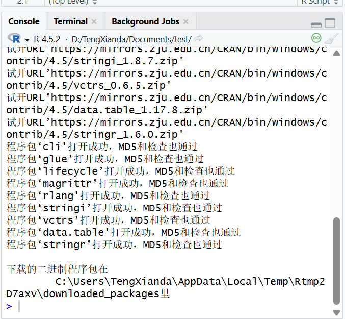
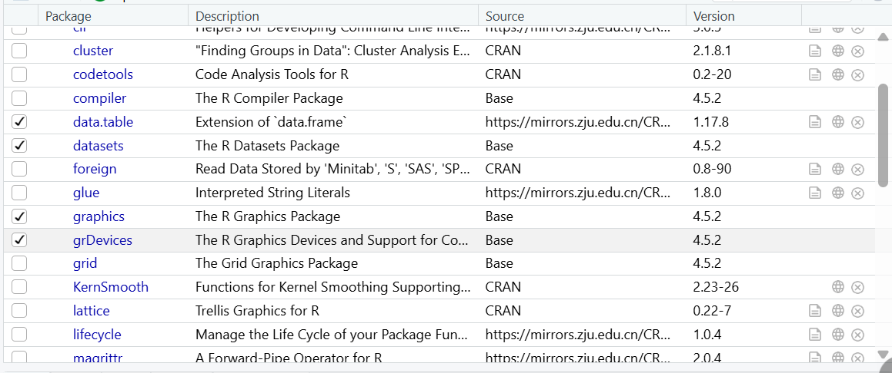

1.运行一行代码：选中要运行的一行代码，点击run按钮（快捷键为“Ctrl+Enter”）;运行多行代码：选中要运行的多行代码，点击run按钮（快捷键为“Ctrl+Enter”）2.

3.install.packages()函数

4.library()函数5.包经过安装之后，下次再打开相关的test.rproj文件还不需要重新安装，每⼀次导入包之后，下次再打开相关的test.rproj文件还需要再次导入。

6.R语言中的赋值符号是"\<-"，快捷键为“Alt+-”7.

8.在注释的内容前加“#”，#后的内容都为注释。Rstudio的快捷键是"Ctrl+Shift+c"
